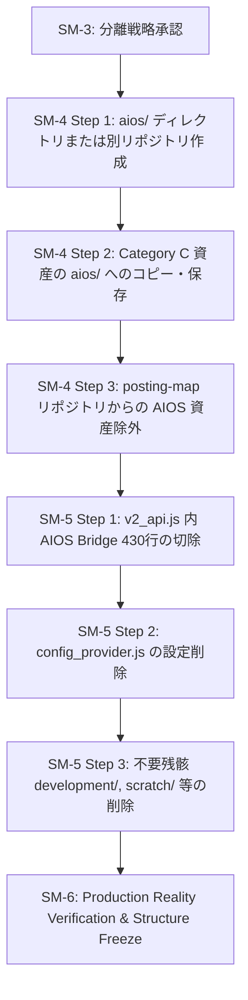

# AIOS Separation Strategy

**Document Version**: 1.0.0  
**Status**: APPROVED  
**Scope**: Project Root (`/Volumes/SSD_DATA/AI Development OS/projects/posting-map`)  
**Execution Mode**: READ ONLY DESIGN MODE (Code Modifications: 0)  

---

## 1. Executive Summary & Purpose

本ドキュメントは、POSTING MAP を AIOS（AI Operating System）から完全に切り離し、AIOS 非依存の単独商品リポジトリとして再構築するための「分離戦略および切除計画」を規定する設計仕様書です。

### 基本原則
1. **Production Lock Protection**: SM-2 にて宣言された 11 個の Production Essential アセット（`active/`, `data/`, `docs/`, `scripts/`, `tests/` 等）を厳重に保護し、分離作業中の誤操作をシステムレベルで防ぐ。
2. **Zero Runtime Impact**: 本分離作業により、POSTING MAP の既存 API エンドポイント（`submitDistribution`, `registerStaff` 等）、データ整合性、デプロイメント（MIE-03）へ与える影響を **100% ゼロ** とする。
3. **READ ONLY Planning**: 本スプリント（SM-3）では実際のコード削除・移動・Git 操作を行わず、分離仕様の定義のみを行う。

---

## 2. Production Asset Lock Verification

SM-2 にてロックされた本番必須アセットの保全状態を再確認します。以下の資産は SM-6 完了まで変更・削除・移動が一切禁止されます。

```
🔒 Protected Production Assets
├── active/                    ← 唯一の本番ソースコード（GAS Deploy対象）
├── data/                      ← マスターデータ (MIE03_ADDRESS_MASTER.csv SSOT)
├── docs/                      ← 設計・監査・仕様ドキュメント
├── scripts/                   ← 開発・検証・運用スクリプト
├── tests/                     ← テストコード
├── AGENTS.md                  ← プロジェクト開発・ガバナンスルール
├── DEPLOYMENT_REGISTRY.md     ← デプロイ環境レジストリ
├── package.json               ← npm 設定
├── appsscript.json            ← GAS マニフェスト
├── .clasp.json                ← clasp 接続設定
└── .claspignore               ← clasp デプロイ除外定義
```

---

## 3. AIOS Separation Boundary Matrix

分離対象となる AIOS 資産と、POSTING MAP に残存する本番資産の完全境界マトリックスです。

| アセット識別子 | 種別 | AIOS 移管 / 排除対象 (Separate) | POSTING MAP 保全対象 (Retain) | 分離・移管先 |
| :--- | :--- | :---: | :---: | :--- |
| **`agents/`** (12ドメイン) | ディレクトリ | ✅ | — | `aios/agents/` |
| **`AI社員/`** | ディレクトリ | ✅ | — | `aios/AI社員/` |
| **`skills/`** | ディレクトリ | ✅ | — | `aios/skills/` |
| **`knowledge/`** | ディレクトリ | ✅ | — | `aios/knowledge/` |
| **`AI_WORKFORCE_CONSTITUTION_v*.md`** (7ファイル) | ドキュメント | ✅ | — | `aios/docs/constitution/` |
| **`CLAUDE.md`** / **`GPT.md`** | プロンプト定義 | ✅ | — | `aios/docs/prompts/` |
| **`HANDOVER.md`** | 引継ぎ文書 | ✅ | — | `aios/docs/handover/` |
| **`aios-manifest.json`** | マニフェスト | ✅ | — | `aios/aios-manifest.json` |
| **`deployment.json`** / **`project.json`** | AIOS 設定 | ✅ | — | `aios/config/` |
| **`active/api/v2_api.js` (L3453-3884)** | ソースコード | ✅ | — | 完全切除 (削除) |
| **`active/runtime/config/config_provider.js`** | ソースコード | ✅ (AIOSフラグのみ) | 残り設定は保全 | 該当フラグ行切除 |
| **`active/`** (その他全ファイル) | ソースコード | — | ✅ | POSTING MAP 内保持 |
| **`data/`** | SSOT データ | — | ✅ | POSTING MAP 内保持 |

---

## 4. `v2_api.js` AIOS Bridge Dead Code Surgical Removal Plan

### 切除対象範囲
`active/api/v2_api.js` 内の以下のクラス・関数群（約 430 行）を完全切除します。

```javascript
// ==========================================
// 🚀 AIOS BRIDGE FOUNDATION CLASSES (切除対象)
// ==========================================
- class BridgeMessage { ... }
- class BridgeResult { ... }
- class BridgePolicy { ... }
- class BridgeEvent { ... }
- class BridgeEventDispatcher { ... }
- class BridgeMessageMapper { ... }
- class BridgeContext { ... }
- class BridgeException extends ApiException { ... }
- const AIOSBridgeMode = { ... }
- function resolveBridgeMode(...) { ... }
- class CapabilityMappingRegistry { ... }
- class CapabilityResolver { ... }
- class AIOSBridgeTaskAdapter { ... }
- class MockAIOSClient { ... }
- class LiveAIOSClient { ... }
- class AIOSClientFactory { ... }
- class AIOSBridgeProvider { ... }
- class AIOSBridgePipeline { ... }
```

### 切除の安全証明 (Safety Proof)
1. **実行時非依存**: `FLAG_AIOS_BRIDGE` のデフォルト値は `false` であり、パイプラインの条件判定 `if (!policy.bridgeEnabled)` により日常の全 API 実行において該当ブロックへ到達しません。
2. **外部クライアント非依存**: LIFF フロントエンドおよびダッシュボード UI は `/aios` エンドポイントを呼び出していません。
3. **他モジュール非依存**: `active/platform/`, `active/framework/`, `active/business/` は `AIOSBridgePipeline` をインポート・参照していません。

---

## 5. `config_provider.js` AIOS Feature Flag Clean-up Plan

`active/runtime/config/config_provider.js` から以下の AIOS 関連設定プロパティを安全に削除します。

```javascript
// 削除対象行:
- aiosBridge: props.getProperty('FLAG_AIOS_BRIDGE') === 'true',
- bridgeEnabled: props.getProperty('FLAG_BRIDGE_ENABLED') !== 'false',
- bridgeHeartbeat: props.getProperty('FLAG_BRIDGE_HEARTBEAT') !== 'false',
- bridgeTimeout: timeoutStr ? parseInt(timeoutStr, 10) : 5000,
- bridgeProvider: props.getProperty('FLAG_BRIDGE_PROVIDER') || 'AIOSBridgeProvider',
- bridgeMode: props.getProperty('FLAG_BRIDGE_MODE') || 'STUB',
```

---

## 6. Migration Sequence & Extraction Procedure (SM-4 向け)

実作業スプリント（SM-4 Clean Repository Migration & SM-5 Cleanup）における安全な実行手順です。



---

## 7. Risk Assessment & Mitigation

| リスク | 影響度 | 対策・検証方法 |
| :--- | :---: | :--- |
| **誤削除によるデプロイ障害** | 低 | Production Asset Lock により 11 個のアセットを物理保護。`clasp push` は `active/` のみを対象とするため影響なし。 |
| **`v2_api.js` 文法エラー** | 中 | 切除後、`npx clasp push -f` 前に構文解析チェックを実施。 |
| **本番 API 互換性破壊** | 低 | 切除後に `submitDistribution`, `registerStaff`, `getDeliveryStats` の Level-5 Production Reality Validation を実行。 |

---

## 8. Rollback Strategy & Verification Standards

### ロールバック方針
- 実際の変更作業（SM-4, SM-5）は Git コミットの直前に実行し、万が一実機検証（Level-5 Validation）でエラーが発生した場合は、`git checkout` または事前にバックアップした `LEGACY_BACKUP` ポイントへ即座に戻せる状態を維持します。

### 完了判定基準 (SM-3)
1. **[aios_separation_strategy.md](file:///Volumes/SSD_DATA/AI%20Development%20OS/projects/posting-map/docs/architecture/aios_separation_strategy.md)** の設計が完成していること。
2. Production Asset Lock 11 アセットが 100% 保全されていること。
3. コード変更数が **0件** であること。
