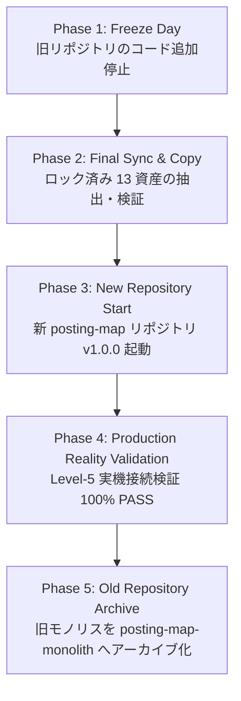

# Repository Creation Plan

**Document Version**: 1.0.0  
**Status**: APPROVED  
**Scope**: Project Root (`/Volumes/SSD_DATA/AI Development OS/projects/posting-map`)  
**Execution Mode**: READ ONLY DESIGN MODE (Code Modifications: 0)  

---

## 1. Executive Summary & Purpose

本ドキュメントは、POSTING MAP を AIOS から完全独立した単独商品リポジトリとして構築・切替（Cutover）を行うための「移行実行憲法仕様書」です。
SM-1〜SM-3 の監査・設計結果を根拠とし、新リポジトリの作成戦略、切り替えタイムライン、初期コミットポリシー、旧モノリスのアーカイブ方針、バージョンリセット仕様、および厳格なロールバック基準を規定します。

---

## 2. Repository Creation Strategy (Option B Adoption)

### 採用案: Option B (Clean Fresh Start)
- **理由**: 現在のリポジトリには AIOS 資産、過去スプリントの試行スクリプト、旧アプリプロトタイプが混在しており、既存 Git 履歴をそのまま持ち込むとノイズが非常に大きいため。POSTING MAP は独立した販売プロダクトとなるため、明確な基準点から新規スタートさせることが最善と判定。
- **旧歴史の保全**: 過去の全コミット履歴および過去コードは `posting-map-monolith` に 100% 永久保存されます。

### 📦 Initial Commit Policy (初期コミット規定)
新リポジトリ `posting-map` のファーストコミット (`Initial Release`) に含まれるアセットは、Production Asset Lock にて固定された以下の **13 項目** のみに限定されます。

```
posting-map/ (v1.0.0 Initial Release Target)
├── active/                    ← 唯一の本番ソースコード (5-Layer Architecture)
├── data/                      ← マスターデータ (MIE03_ADDRESS_MASTER.csv SSOT)
├── docs/                      ← ドキュメント (設計・仕様・監査レポート)
├── scripts/                   ← 開発・検証・運用スクリプト
├── tests/                     ← テストコード・テストランナー
├── .agents/                   ← エージェント開発ルール
├── .agent-artifacts/          ← エージェント成果物保存領域
├── AGENTS.md                  ← プロジェクト開発ガバナンスルール
├── DEPLOYMENT_REGISTRY.md     ← デプロイ環境レジストリ
├── package.json               ← npm 設定
├── appsscript.json            ← GAS マニフェスト
├── .clasp.json                ← clasp 接続設定 (MIE-03)
└── .claspignore               ← clasp デプロイ除外定義
```

---

## 3. Cutover Timeline & Sequence

旧モノリス構造から新クリーンリポジトリへの物理切り替え順序です（実行は SM-5 にて実施）。



1. **Phase 1: Freeze Day**: 旧リポジトリへの機能追加・コミットを完全凍結。
2. **Phase 2: Final Sync & Copy**: Production Lock 資産の抽出と `v2_api.js` 内 AIOS Bridge コード (430行) の切除。
3. **Phase 3: New Repository Start**: 新リポジトリを作成し、`v1.0.0` の `Initial Release` コミットを作成。
4. **Phase 4: Production Reality Validation**: MIE-03 環境にて `clasp deploy` および Level-5 Validation を実行。
5. **Phase 5: Old Repository Archive**: 検証成功後、旧リポジトリを `posting-map-monolith` (READ ONLY) として保管。

---

## 4. Rollback Strategy (ロールバック安全保障基準)

新リポジトリの作成・切替時に予期せぬ障害が発生した場合の復帰計画です。

- **Rollback Target**: 旧モノリスリポジトリ (`posting-map-monolith` 状態)
- **Trigger Conditions (即時発動条件)**:
  1. 新リポジトリからの `clasp push` または `clasp deploy` の失敗
  2. GAS Script ID (`158Avw8hAtZx...`) または Web App URL の予期せぬ変更発生
  3. POST `submitDistribution`, `registerStaff` 等の主要 API での互換性回帰 (Regression) 発生
  4. ダッシュボード / LIFF 画面の表示・通信障害発生
- **Procedure**: 切替作業を即座に中断し、旧リポジトリからのデプロイ環境へロールバック。

---

## 5. Git History Policy & Archive Policy

- **新リポジトリ (`posting-map`)**: `v1.0.0` を第1コミットとするクリーンな履歴体系を新規開始。
- **旧リポジトリ (`posting-map-monolith`)**: 過去の全開発コミット履歴、試行コード (`development/`)、旧プロトタイプ (`app/`, `field/`) を含むリポジトリとして **READ ONLY 永久保存**。過去コードの参照が必要な場合はこのアーカイブを参照する。

---

## 6. Version Reset Policy (`v1.0.0`)

- **製品境界の変更宣言**: POSTING MAP は AIOS 混在型プロトタイプから **「単独販売プロダクト (POSTING MAP Standard Edition)」** へ製品定義が昇格するため、バージョンを **`v1.0.0`** へリセット・新スタートします。
- **バージョン管理規約**: 以降のバージョン変更は `MAJOR.MINOR.PATCH` のセマンティックバージョニングに厳格に従います。

---

## 7. Acceptance Criteria (完成判定基準)

SM-6 (Repository Freeze) 宣言時に必須となる定量的チェックリストです。

### 🔍 Repository Independence Check (独立性検証)
- [ ] リポジトリ内に `agents/`, `AI社員/`, `skills/`, `knowledge/` フォルダが存在しないこと (0件)
- [ ] `v2_api.js` 内に AIOS Bridge クラス群 (L3453-3884) が存在しないこと (0行)
- [ ] `config_provider.js` 内に `aiosBridge` 等のフラグが存在しないこと (0件)
- [ ] `aios-manifest.json` 等の AIOS 定義ファイルが存在しないこと (0件)
- [ ] ソースコード内に AIOS への `import` / `require` / 直参照が存在しないこと (0件)

### 🚀 Production Validation Check (本番検証)
- [ ] `active/` ディレクトリ配下のみで `npx clasp push -f` が成功すること
- [ ] `npx clasp deploy -i <deployment_id>` による更新デプロイが成功すること
- [ ] 固定 Web App URL が変更されず維持されていること
- [ ] GET `action=debugCount` が HTTP 200 OK を返すこと
- [ ] POST `submitDistribution` が HTTP 200 OK (`{"success":true}`) を返すこと
- [ ] POST `registerStaff` が HTTP 200 OK (`{"success":true}`) を返すこと
- [ ] ダッシュボード UI および LIFF アプリが正常動作すること

---

## 8. Migration Order (SM-5〜SM-7)

本設計書に基づく今後の移行手順です。

```
Sprint SM-5: Physical Separation & Cleanup
  ├── AIOS 資産の物理退避 (aios/ へのコピー)
  ├── v2_api.js 内 AIOS Bridge コード 430行の切除
  └── 不要残骸 (development/, scratch/, temp/ 等) の最終削除

Sprint SM-6: Repository Freeze & Validation
  └── 新クリーンリポジトリ作成、Acceptance Criteria 検証 & Repository Structure v1.0 宣言

Sprint SM-7: Phase 2 Resume
  └── P2-11D Area Domain Service の実装再開
```
